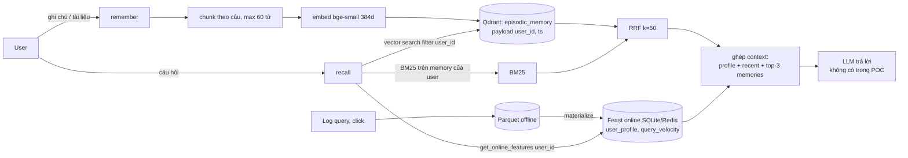

# Bonus: Hybrid Memory cho trợ lý AI cá nhân (tiếng Việt)

> Author Nguyễn Đức Danh - 2A202602722

Mục tiêu là một trợ lý nhớ được 2 loại thông tin rất khác nhau:

- **Episodic memory**: những gì user đã đọc, đã hỏi, đã ghi chú. Loại này nhiều, thay đổi liên tục, và phải tìm theo
  nghĩa. Mình để nó trong **Qdrant** (vector store).
- **Profile và hoạt động gần đây**: user thích chủ đề gì, đọc nhanh hay chậm, dùng tiếng Việt hay tiếng Anh, 1 giờ qua
  hỏi bao nhiêu câu. Loại này ít, có cấu trúc, cần lookup cực nhanh theo `user_id`. Mình để nó trong **Feast** (feature
  store).

Code POC nằm ở `bonus/agent.py` (class `HybridMemoryAgent`) và `bonus/demo.py`.

## Sơ đồ kiến trúc

Đường ghi (remember) và đường đọc (recall) tách nhau. Feast không nằm trên đường ghi của memory: profile được cập nhật
bằng job riêng từ log, không phải mỗi lần user ghi chú.

## Quyết định 1: Chunking strategy

**Chọn:** cắt theo ranh giới câu, gom các câu liền nhau đến khi đủ khoảng 60 từ thì cắt chunk mới.

**So với các lựa chọn khác:**

- *Mỗi message 1 chunk:* đơn giản nhất, nhưng message dài (dán cả bài viết vào) sẽ thành 1 vector "trung bình" của nhiều
  ý, search ra được nhưng rất mờ. Message ngắn kiểu "ok cảm ơn" lại thành rác trong index.
- *Mỗi cuộc hội thoại 1 chunk:* tiết kiệm storage nhất, nhưng retrieval kém vì 1 cuộc hội thoại thường có 3 đến 5 chủ
  đề. Đây đúng là vấn đề mà NB6 cho thấy: embed 1 câu hỏi ghép thì vector rơi vào giữa 2 cụm.
- *Semantic chunking (cắt khi độ tương đồng giữa 2 câu liền nhau giảm mạnh):* chất lượng tốt nhất, nhưng phải embed từng
  câu một lần để quyết định chỗ cắt, rồi embed lại chunk. Chi phí embed gấp khoảng 2 lần.

**Tradeoff:** 60 từ là điểm giữa giữa *retrieval quality* và *context window*. Lấy top-3 chunk thì context chỉ khoảng
180 từ, còn dư chỗ cho profile và câu hỏi. Chunk to hơn thì mỗi lần recall nhét nhiều chữ không liên quan vào prompt.
Chunk nhỏ hơn (1 câu) thì số point tăng gấp 3, và câu tiếng Việt ngắn kiểu "Pod là đơn vị nhỏ nhất." mất ngữ cảnh
"Kubernetes" ở câu trước. Về storage, 384 chiều float32 là khoảng 1.5KB mỗi chunk, nên 1 user có 10.000 chunk vẫn chưa
tới 20MB, chi phí chủ yếu nằm ở thời gian embed chứ không phải dung lượng.

## Quyết định 2: Feature schema

**Chọn:** dùng lại 2 feature view có sẵn từ NB4, entity `user`:

| feature                      | view                    | ttl     | nguồn                          |
|------------------------------|-------------------------|---------|--------------------------------|
| `topic_affinity` (string)    | user_profile_features   | 30 ngày | batch hàng ngày từ lịch sử đọc |
| `preferred_language` (vi/en) | user_profile_features   | 30 ngày | batch hàng ngày                |
| `reading_speed_wpm` (int)    | user_profile_features   | 30 ngày | batch hàng ngày                |
| `queries_last_hour` (int)    | query_velocity_features | 1 giờ   | streaming / push               |
| `distinct_topics_24h` (int)  | query_velocity_features | 1 giờ   | streaming / push               |

**Tabular hay embedding feature?** Mình chọn tabular. Phương án kia là lưu 1 "user embedding" (trung bình vector những
gì user đã đọc) như 1 feature. Nó bắt được sở thích tinh hơn 1 chữ `cloud`, nhưng có 3 vấn đề: (1) đổi embedding model
là phải tính lại toàn bộ feature, trong khi lab đã cho thấy đổi model là đổi số chiều, (2) không debug được, nhìn
`topic_affinity = cloud` thì hiểu ngay, nhìn 384 con số thì chịu, (3) feature này chỉ dùng được bằng cách đưa vào vector
search, mà việc đó memory trong Qdrant đã làm rồi. Tabular feature thì đưa thẳng vào prompt dưới dạng chữ được, và dùng
làm filter `topic` như `build_context()` ở NB6.

TTL khác nhau là có chủ ý: profile mà 30 ngày không có dữ liệu mới thì vẫn tạm đúng, còn `queries_last_hour` cũ hơn 1
giờ là sai nghĩa, thà trả về rỗng còn hơn trả số cũ.

## Quyết định 3: Freshness strategy

Câu hỏi: user vừa đọc xong 1 tài liệu, bao lâu sau "trợ lý nhớ gì về tôi?" mới thấy nó?

| use case                                       | độ tươi             | cách làm                                                                                     |
|------------------------------------------------|---------------------|----------------------------------------------------------------------------------------------|
| Memory vừa ghi ("tóm tắt lại cái tôi vừa đọc") | dưới 1 giây         | `remember()` upsert thẳng vào Qdrant, không qua batch. Qdrant thấy point ngay sau upsert.    |
| Hoạt động gần đây (`queries_last_hour`)        | vài giây đến 5 phút | Feast push source / stream (Kafka) ghi vào online store. Trong POC là parquet + materialize. |
| Profile (`topic_affinity`, tốc độ đọc)         | hàng ngày           | batch job tính từ log rồi `materialize-incremental` mỗi đêm.                                 |

**Tradeoff:** làm tất cả real-time thì đơn giản về mặt khái niệm nhưng tốn tiền và khó đúng. `topic_affinity` tính lại
sau mỗi bài đọc sẽ dao động liên tục (đọc 1 bài security là thành "security"), cái đó còn tệ hơn trễ 1 ngày. Ngược lại
memory mà phải chờ batch thì user hỏi lại ngay sẽ thấy trợ lý "quên", lỗi này user nhận ra liền. Nên mỗi loại dữ liệu có
độ tươi riêng theo việc sai thì user thấy nhanh tới đâu.

## Phương án đã loại bỏ

**Mình đã cân nhắc lưu episodic memory trong feature store** (1 feature view kiểu embedding theo `user_id`) cho gọn 1 hệ
thống, **nhưng tách ra Qdrant** vì 2 lý do. Thứ nhất, nhịp cập nhật khác hẳn: memory thêm mới mỗi vài phút, profile đổi
theo ngày. Ép cả 2 vào chu kỳ materialize thì hoặc memory bị trễ, hoặc phải materialize liên tục. Thứ hai, Feast online
store là key-value lookup theo entity key, nó không làm nearest-neighbor search được. Muốn tìm "memory nào gần câu hỏi
nhất" thì vẫn phải kéo hết về rồi tự tính cosine.

**Mình cũng loại phương án mỗi user 1 collection Qdrant.** Cách ly tốt, nhưng 100.000 user là 100.000 collection, mỗi
cái có HNSW index riêng, rất tốn RAM và Qdrant không khuyến khích. Mình dùng 1 collection và filter `user_id` trong
payload (filtered ANN như NB5, không phải post-filter). NB5 đã cho thấy post-filter sập recall khi filter hẹp, mà filter
theo 1 user là cực hẹp. Đánh đổi là nếu quên filter thì lộ dữ liệu, nên `search()` luôn gắn filter, và `demo.py` có kiểm
tra memory của `u_002` không bao giờ xuất hiện khi `u_001` hỏi.

## Lưu ý riêng cho tiếng Việt

- **Gõ không dấu và lỗi telex:** user hay gõ "tu dong mo rong" hoặc "tuwj ddoongj". BM25 tách theo khoảng trắng thì "tự"
  và "tu" là 2 token khác nhau. Trong `tokenize()` mình index cả bản có dấu lẫn bản đã bỏ dấu (`strip_accents`), nên
  query không dấu vẫn match. Lỗi telex dở dang thì chưa xử lý (xem phần giới hạn).
- **Unicode NFC và NFD:** cùng chữ "hoà" có thể là 1 ký tự hoặc chữ cái cộng dấu tổ hợp tuỳ bộ gõ. Mình normalize NFC
  trước khi tách token, không thì BM25 coi là 2 từ khác nhau mà nhìn bằng mắt không thấy.
- **Code-switching:** câu kiểu "Cho tôi summary cloud security" trộn Việt và Anh. Đây lại là chỗ hybrid có lợi:
  bge-small là model tiếng Anh nên bắt được "cloud security" khá tốt, còn BM25 lo phần từ tiếng Việt. NB2 cho thấy
  bge-small yếu với câu diễn đạt lại thuần Việt (paraphrase chỉ 24% so với 33% của BM25), nên production nên đổi sang
  `bge-m3` hoặc `multilingual-e5`.
- **Tách từ:** tiếng Việt có từ ghép ("cơ sở dữ liệu" là 1 từ, 4 âm tiết). Tách theo khoảng trắng làm BM25 match từng âm
  tiết, "cơ sở" khớp nhầm sang chỗ khác. `underthesea` hoặc `pyvi` tách đúng hơn nhưng chậm hơn nhiều lần và thêm
  dependency. Với POC mình giữ whitespace, vì vector search đã bù phần ngữ nghĩa.
- **Privacy (Nghị định 13/2023):** ghi chú cá nhân là dữ liệu cá nhân, user có quyền yêu cầu xoá. Thiết kế 1
  collection + payload `user_id` cho phép xoá hết memory của 1 user bằng 1 lệnh delete theo filter.

## POC này chưa làm được gì

- Chưa có xoá / sửa memory (CRUD), chưa có memory decay (memory 30 ngày không ai truy cập thì archive).
- BM25 đang build lại mỗi lần recall trên memory của user. Ít memory thì ổn, vài nghìn chunk thì phải cache index theo
  user.
- Chưa xử lý telex gõ dở ("tuwj"), chưa có spell correction.
- Profile chỉ đọc từ Feast, chưa có job cập nhật `topic_affinity` từ chính memory user vừa ghi.
- Không mã hoá at rest, không tách quyền theo tenant ngoài filter `user_id`.
- Chưa gọi LLM, `recall()` chỉ trả về context string.

## Ghi chú vibe-coding

Prompt hiệu quả nhất là đưa đúng spec: "RRF k=60, rank 1-based, vector search phải có filter user_id, BM25 chỉ trên
memory của user đó". Có spec rõ thì code đúng ngay lần đầu. Prompt kém nhất là "làm agent có memory", nó đề xuất ngay
mỗi user 1 collection và gọi LLM thật, cả 2 đều không hợp với lab chạy không cần key.
